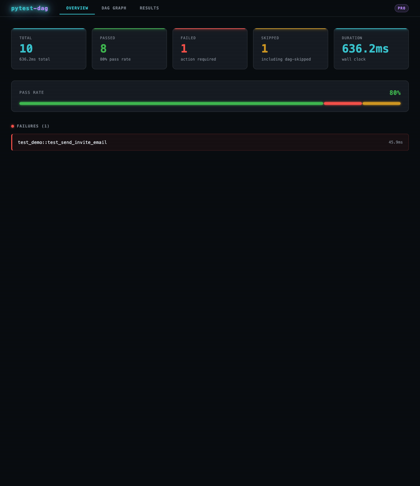
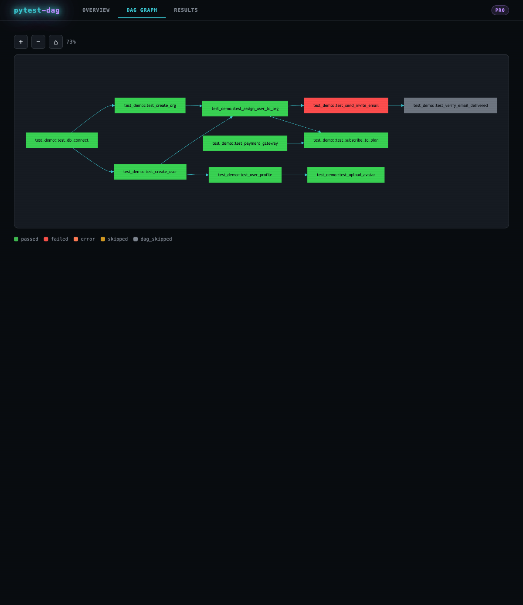
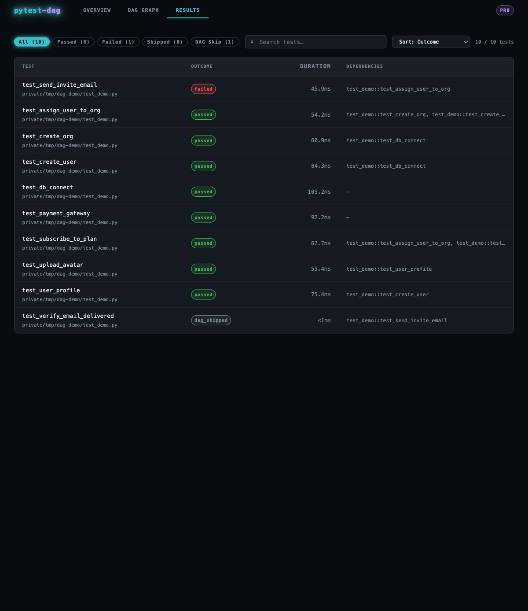

# License & Tiers

`pytest-dag` ships with a **freemium model**. No license key is required to
get started. A pro key unlocks additional capabilities.

## Tier comparison

| Feature | Free | Pro |
|---|---|---|
| DAG enforcement | ✓ | ✓ |
| YAML DAG file | ✓ | ✓ |
| Cross-file dependencies | ✓ | ✓ |
| Max DAG nodes | 25 | Unlimited |
| Max DAG depth | 5 | Unlimited |
| Parallel workers (`--dag-workers`) | — | ✓ |
| HTML report (`--dag-report-out`) | — | ✓ |
| Run banner | shown | silent |

## Report preview (Pro)

The pro tier generates an interactive single-page HTML report after every run.

**Overview** — pass/fail/skip stat cards, segmented progress bar, failure list:



**DAG Graph** — pan/zoom dependency flowchart, colour-coded by outcome:



**Results** — filterable, searchable, sortable test table with timing and dependency info:



---

## Free tier

No configuration needed. Install and run:

```bash
pip install pytest-dag
pytest
```

A one-line banner is printed on each run to indicate the free tier. Tests run
sequentially. DAGs up to 25 nodes and depth 5 are supported.

## Pro tier

Set the license key via environment variable, CLI flag, or key file.

### Environment variable (recommended for CI)

```bash
export PYTEST_DAG_LICENSE_KEY=<your-license-key>
pytest --dag-report-out report.html --dag-workers 4
```

### CLI flag

```bash
pytest --pytest-dag-license-key <your-license-key>
```

### Key file

```bash
pytest --pytest-dag-license-key-file /path/to/key.txt
```

## CI setup

Store the key as a secret in your CI provider and expose it as
`PYTEST_DAG_LICENSE_KEY`. The plugin reads it automatically — no extra flags
needed.

**GitHub Actions / Forgejo Actions:**

```yaml
env:
  PYTEST_DAG_LICENSE_KEY: ${{ secrets.PYTEST_DAG_LICENSE_KEY }}
```

## Purchase or renew

- `https://slrsoft.ca/app/pytest-dag/purchase`

## How verification works

Keys are verified **locally** — no network calls are made at any point.
The plugin works identically on air-gapped machines, behind firewalls,
and in offline CI environments.

## Support

- `support@slrsoft.ca`
